# 软件开发常见模型

# 1 软件开发流程

# 2 常见模型

## 2.1 瀑布模型

定义：瀑布模型(Waterfall Model)是将软件生存周期的各项活动规定为按固定顺序而连接的若干阶段工作，形如瀑布流水，最终得到软件产品。
地位：这是一种经典模型,提供了软件开发的基本框架。
优点:
1）各阶段划分清晰
2）强调计划与需求分析
3）适合需求稳定的产品开发
缺点:
1）单一流程，不可逆
2）风险显露得晚，纠正机会少
3）测试只是其中一个阶段，缺乏全过程测试思想

## 2.2 V模型

定义：RAD (Rap Application Development,快速应用开发) 模型是软件开发过程中的一个重要模型，由于其模型构图形似字母V，所以又称软件开发的V模型。它通过开发和测试同时进行的方式来缩短开发周期，提高开发效率。
优点：相对于瀑布模型，V模型测试能够尽早的进入到开发阶段。
缺点：虽然测试尽早的进入到开发阶段，但是真正进行软件测试是在编码之后，这样忽视了测试对需求分析，系统设计的验证，时间效率上也大打折扣。

## 2.3 W模型

定义：W模型，由Evolutif公司提出， 相对于V模型，W模型增加了软件开发各阶段中同步进行的验证和确认活动。如图所示，由两个V字型模型组成，分别代表测试与开发过程，图中明确表示出了测试与开发的并行关系。
优点：W 模型相对于 V 模型来说，测试更早的进入到开发阶段，与开发阶段是并行关系，更早的发现问题，能够及时解决问题，各个阶段分工明确，方便管理。
缺点：W 模型是顺序性的，不可逆，需求的变更和调整，依旧不方便。

## 2.4 敏捷开发

定义：从1990年代开始逐渐引起广泛关注,是一种以人为核心、快速迭代、循序渐进的开发方法。强调以人为本，专注于交付对客户有价值的软件。是一个用于开发和维持复杂产品的框架。就是把一个大项目分为多个相互联系，但也可独立运行的小项目，并分别完成，在此过程中软件一直处于可使用状态。
优点：敏捷确实是项目进入实质开发迭代阶段，用户很快可以看到一个基线架构版的产品。敏捷注重市场快速反应能力，也即具体应对能力，客户前期满意度高。
缺点：但敏捷注重人员的沟通，忽略文档的重要性，若项目人员流动大太，又给维护带来不少难度，特别项目存在新手比较多时，老员工比较累。需要项目中存在经验较强的人，要不大项目中容易遇到瓶颈问题。