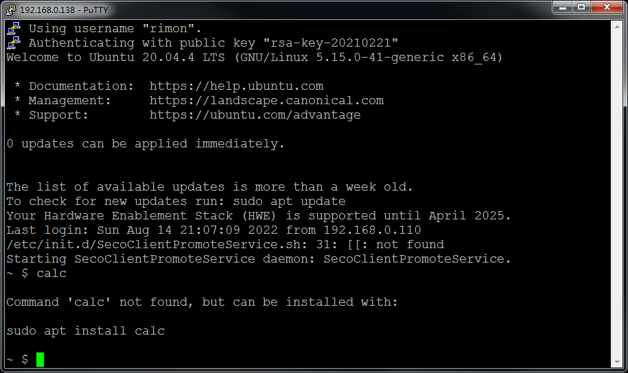
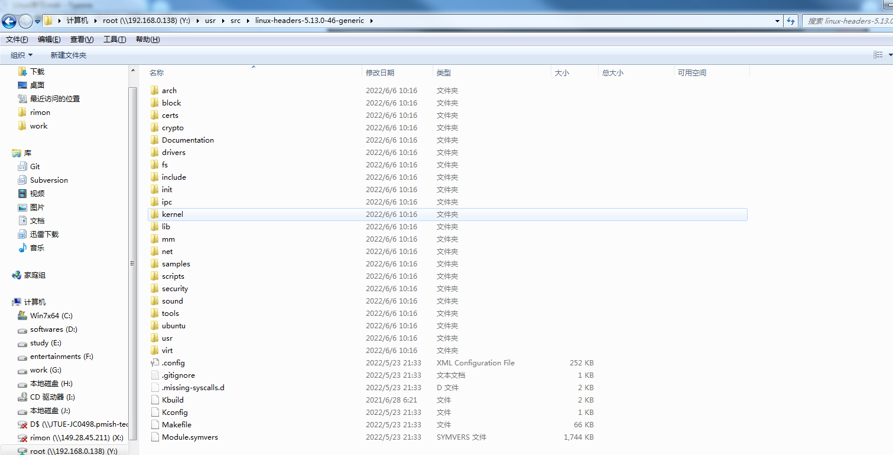
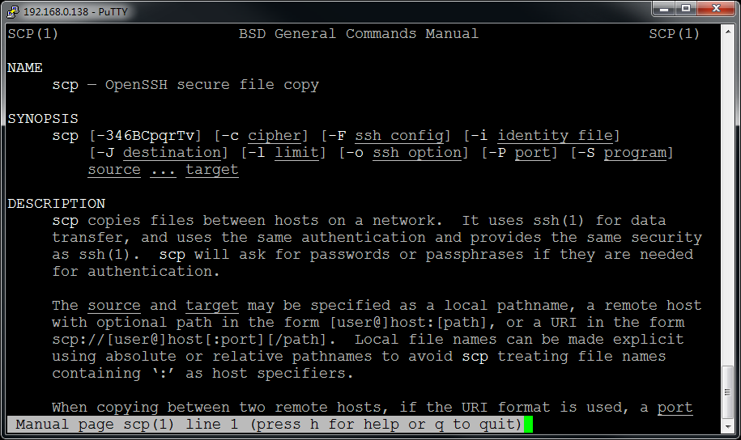
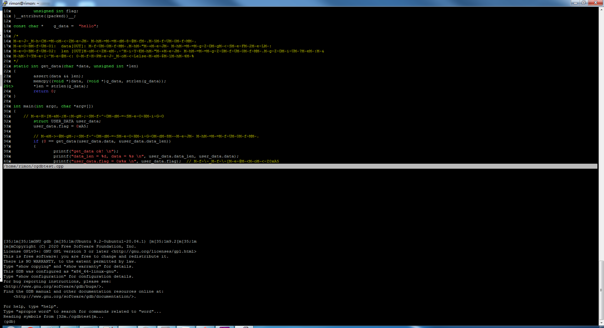

# Linux学习指引

​                                                                                                                                                                                   Edited by Rimon Chen

## 1 Linux发行版本选择

选择合适自己的，个人建议Ubuntu，原因如下：

(1) 有比较全的软件仓库(APT)，同时输入命令时如果未安装会提示安装的软件包(yum就没那么智能)

​    

(2) 相对易用的软件界面（作为入门还是可以的，后面慢慢需要摆脱出来）

​    推荐方法虚拟机+samba+ssh

(3) 基于标准内核之上的相对独立的修改（而不是魔改版本，如雨林木风OS)



(4) 完善的论坛、社区（不要永远只会百度)      https://askubuntu.com/

## 2 Linux环境设置

openssh(证书登录)

samba

vim(配合nerdtree插件)

## 3 Linux Shell

鸟哥 Linux 私房菜：基础版.pdf

man: 不懂就问男人，不要永远只会百度，你出现的问题别人不一定遇到，别人遇到解决后也不一定发到网上，哪怕发到网上的也不一定解释全面，man帮助手册是最全最权威性的资料



## 4 Linux编程

### 4.1 Linux编程环境准备

make

gcc

cgdb

cmake/qt

### 4.1 Linux工程管理

makefile

CMakeLists.txt

project.pro

### 4.2 Linux系统API编程

Linux系统编程.pdf

errno: 函数调用的常见错误码

守护进程编写（促使你去了解文件描述符、标准输入输出、错误输出、fork、进程、进程树、会话、工作目录等概念）

### 4.3 Linux网络编程

Linux网络编程.pdf
socket编程接口
基于TCP的协议设计

### 4.4 Linux程序调试

#### 4.4.1 GDB

编译代码时加上“-g -o0

| 选项   | 备注                                                         |
| ------ | ------------------------------------------------------------ |
| -O0    | 不做任何优化，这是默认的编译选项                             |
| O和-O1 | 优化会消耗少多的编译时间，它主要对代码的分支，常量以及表达式等进行优化。 |
| -O2    | 会尝试更多的寄存器级的优化以及指令级的优化，它会在编译期间占用更多的内存和编译时间。 |
| -O3    | 在O2的基础上进行更多的优化，例如使用伪寄存器网络，普通函数的内联，以及针对循环的更多优化。 |
| -Os    | 主要是对代码大小的优化，我们基本不用做更多的关心。 通常各种优化都会打乱程序的结构，让调试工作变得无从着手。并且会打乱执行顺序，依赖内存操作顺序的程序需要做相关处理才能确保程序的正确性。 |

启动gdb如下：

```bash
gdb ./cgdbtest
```


常用命令：

| 命令                      | 意义                                                         |
| ------------------------- | ------------------------------------------------------------ |
| set args 参数             | 设置程序启动参数                                             |
| info 参数                 | 列出相关信息，支持的有<br />info thread 列出当前所有线程<br />info sources 列出当前进程的源文件<br />info stack 列出调用栈<br />info breakpoints  列出所有断点信息 |
| b 行号<br />b 文件名:行号 | 在指定文件的对应行设置断点                                   |
| disable 数字              | 禁用info b 对应编号的断点                                    |
| enable 数字               | 启动info b 对应编号的断点                                    |


#### 4.4.2 CGDB

CGDB是GDB的前端，以类似于vim的方式可视相关代码和指令，非常方便。启动cgdb如下

```bash
cgdb ./cgdbtest
```

启动后界面如下：



常用快捷键:

| 快捷键   | 意义                    |
| -------- | ----------------------- |
| ESC      | 进入代码窗口            |
| i        | 进入调试窗口            |
| space    | 在代码窗口设置/取消断点 |
| o        | 打开代码所在的文件      |
| /        | 在代码中搜索字符串      |
| ?        | 在代码中搜索字符串      |
| -        | 缩小代码窗口            |
| +        | 扩大代码窗口            |
| gg       | 光标移动到文件头部      |
| GG       | 光标移动到文件尾部      |
| ctrl + b | 代码向上翻一页          |
| ctrl + u | 代码向上翻半页          |
| ctrl + f | 代码向下翻一页          |
| ctrl + d | 代码向下翻半页          |


远程gdb+vscode

ulimit -c unlimited

善于使用proc/sys虚拟文件系统获取信息

查看/var/log下面相关的log

demsg

### 4.5 Linux驱动程序了解

虽然不一定要写驱动，稍微了解一下框架有助于理解Linux的一些概念，便于定位问题

### 4.6 Linux源码阅读

## 5 Linux交叉编译

uboot(x86_64下为grub)

Linux开机引导过程

没有开发板用wine，简单的选项处理，不需要精通，有个概念即可

