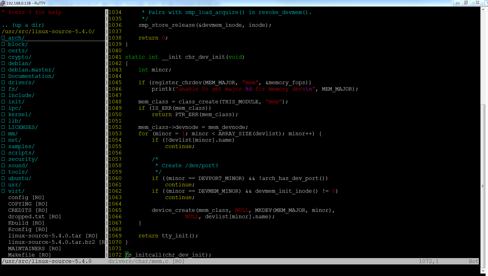
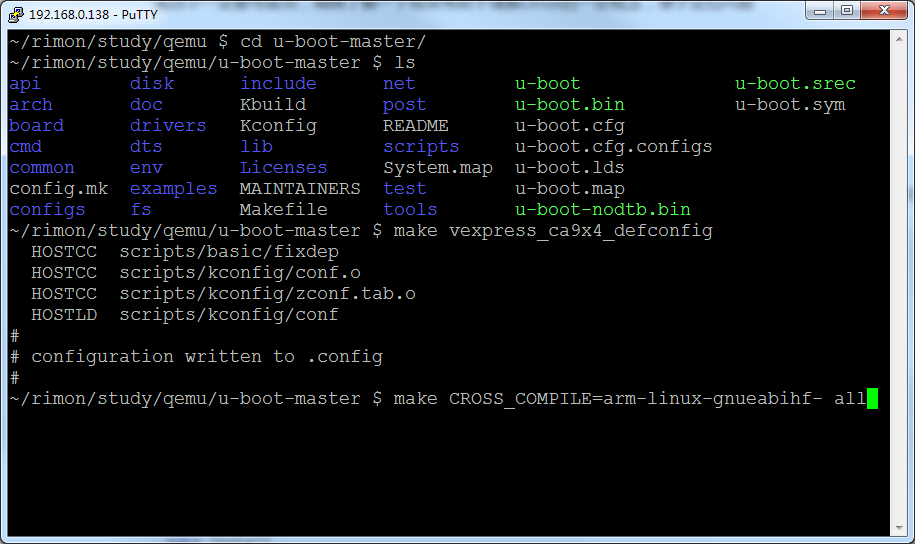
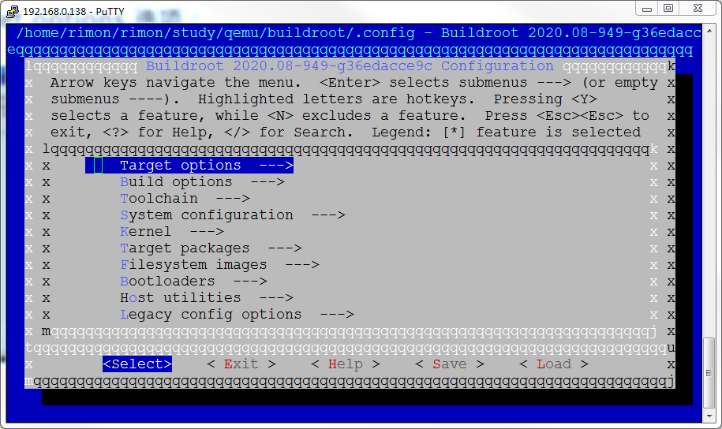
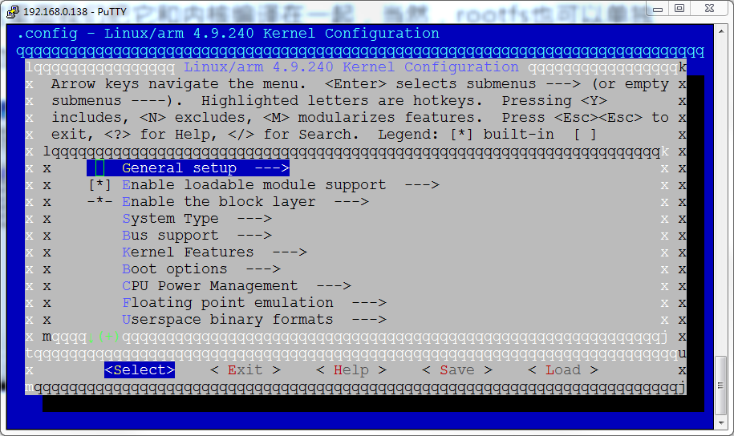
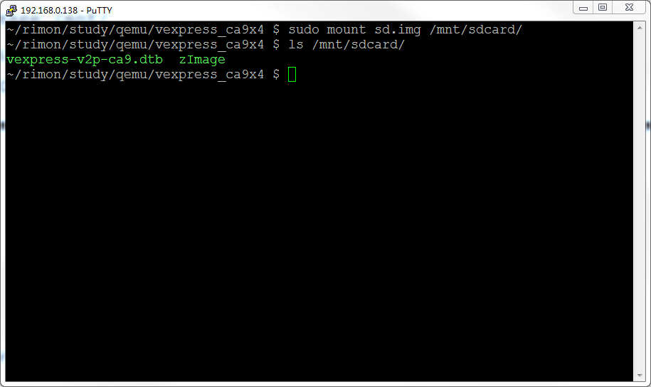

# Linux学习指引

​                                                                                                                                                                                   Edited by Rimon Chen

## 1 Linux发行版本选择

选择合适自己的，个人建议Ubuntu，原因如下：

(1) 有比较全的软件仓库(APT)，同时输入命令时如果未安装会提示安装的软件包(yum就没那么智能)

​    

(2) 相对易用的软件界面（作为入门还是可以的，后面慢慢需要摆脱出来）

​    推荐方法虚拟机+samba+ssh

(3) 基于标准内核之上的相对独立的修改（而不是魔改版本，如雨林木风OS)


(4) 完善的论坛、社区（不要永远只会百度)      https://askubuntu.com/

## 2 Linux环境设置

openssh(证书登录)

samba

vim(配合nerdtree插件)

## 3 Linux Shell

鸟哥 Linux 私房菜：基础版

man: 不懂就问男人，不要永远只会百度，你出现的问题别人不一定遇到，别人遇到解决后也不一定发到网上，哪怕发到网上的也不一定解释全面，man帮助手册是最全最权威性的资料


### 3.1 常用命令

(0) 一般命令

```bash
man
echo 
date
exit
clear
alias
```


(1) 文件系统

```bash
ls
find
cd
cp
mv
mkdir
rm
rmdir
touch
dd
chmod
chown
chgrp
mount
unmount
ln
tar
zip
unzip
xz
sync
```

(2) 文本处理

```bash
cat
grep
head
tail
more
less
wc
diff
```

(3) 进程相关

```bash
top
ps
pstree
kill
killall
pkill
```

(4) 账户管理

```bash
w
who
whoami
adduser
deluser
groupadd
groupdel
passwd
su
sudo
last
```

(5) 网络相关

```bash
ifconfig
ip
ping
netstat
telnet
route
ssh
scp
ftp
wget
curl
```

(6) 软件安装

```bash
apt
snap
dpkg
```


(7) 内核相关

```bash
dmesg
uname
insmod
lsmod
rmmod
modinfo
modprobe
depmod

```


### 3.2 基本shell

```bash
if [ condition ]; then
	# 条件真的脚本
fi
```

```bash
if [ condition1 ]; then
	# scripts
elif [ condition2 ]; then
	# scripts
else
	# scripts
fi
```

```bash
while [ condition ]
do
	# scripts
done
```

```bash
until [ condition ]
do
     # scripts
done
```

```bash
for var in con1 con2 con3 ..
do
	# scripts
done
```


## 4 Linux编程

### 4.1 Linux编程环境准备

make

gcc

cgdb

cmake/qt

### 4.1 Linux工程管理

makefile

CMakeLists.txt

project.pro

### 4.2 Linux系统API编程

(1) 一切皆文件,常见IO模型: 阻塞IO模型\非阻塞IO模型\IO复用模型\信号驱动IO模型\异步IO模型

(2) errno: 函数调用的常见错误码

(3) 守护进程编写（促使你去了解文件描述符、标准输入输出、错误输出、fork、进程、进程树、会话、工作目录等概念）

### 4.3 Linux网络编程

socket编程接口
基于TCP的协议设计

服务器编程模型

### 4.4 Linux程序调试

#### 4.4.1 GDB

编译代码时加上“-g -o0

| 选项   | 备注                                                         |
| ------ | ------------------------------------------------------------ |
| -O0    | 不做任何优化，这是默认的编译选项                             |
| O和-O1 | 优化会消耗少多的编译时间，它主要对代码的分支，常量以及表达式等进行优化。 |
| -O2    | 会尝试更多的寄存器级的优化以及指令级的优化，它会在编译期间占用更多的内存和编译时间。 |
| -O3    | 在O2的基础上进行更多的优化，例如使用伪寄存器网络，普通函数的内联，以及针对循环的更多优化。 |
| -Os    | 主要是对代码大小的优化，我们基本不用做更多的关心。 通常各种优化都会打乱程序的结构，让调试工作变得无从着手。并且会打乱执行顺序，依赖内存操作顺序的程序需要做相关处理才能确保程序的正确性。 |

(1) 示例1 类型不一致

```c
#include <unistd.h>
#include <stdlib.h>
#include <stdio.h>
#include <string.h>
#include <assert.h>

typedef struct USER_DATA{
        char data[32];
        unsigned short data_len;
        unsigned int flag;
}__attribute((packed))__;

const char *    g_data =  "hello";

static int get_data(char *data, unsigned int *len)
{
        assert(data && len);
        memcpy((void *)data, (void *)g_data, strlen(g_data));
        *len = strlen(g_data);
        return 0;
}

int main(int argc, char *argv[])
{
        struct USER_DATA user_data;
        user_data.flag = 0xA5;

        if (0 == get_data(user_data.data, &user_data.data_len))
        {
                printf("get_data ok! \n");
                printf("data_len = %d, data = %s \n", user_data.data_len, user_data.data);
                printf("user_data.flag = 0x%x \n", user_data.flag);
        }
        else
        {
                printf("get_data failed! \n");
        }
        return 0;
}

```

调试方法：断点逐步运行

启动gdb如下：

```bash
gdb ./cgdbtest
```

(2) 示例2 空指针

```c
#include <stdio.h>
#include <string.h>

int main(int argc, char* argv[])
{
    int* pValue = NULL;
    *pValue = 0;
    
    return 0;
}
```

调试方法：gdb直接运行，看堆栈

```bash
~/rimon/study/linux/gdb $ gdb ./nulltest
GNU gdb (Ubuntu 9.2-0ubuntu1~20.04.1) 9.2
Copyright (C) 2020 Free Software Foundation, Inc.
License GPLv3+: GNU GPL version 3 or later <http://gnu.org/licenses/gpl.html>
This is free software: you are free to change and redistribute it.
There is NO WARRANTY, to the extent permitted by law.
Type "show copying" and "show warranty" for details.
This GDB was configured as "x86_64-linux-gnu".
Type "show configuration" for configuration details.
For bug reporting instructions, please see:
<http://www.gnu.org/software/gdb/bugs/>.
Find the GDB manual and other documentation resources online at:
    <http://www.gnu.org/software/gdb/documentation/>.

For help, type "help".
Type "apropos word" to search for commands related to "word"...
Reading symbols from ./nulltest...
(gdb) r
Starting program: /home/rimon/rimon/study/linux/gdb/nulltest

Program received signal SIGSEGV, Segmentation fault.
0x0000555555555144 in main (argc=1, argv=0x7fffffffe1f8) at nulltest.c:7
7           *pValue = 0;
(gdb) where
#0  0x0000555555555144 in main (argc=1, argv=0x7fffffffe1f8) at nulltest.c:7
(gdb)
```


(3) 示例3 多线程

```cpp
#include <pthread.h>
#include <stdio.h>
#include <string>

#include <unistd.h>

void pushChar2Str(std::string &str, char ch)
{
        str.push_back(ch);
}

void* thdFun(void* arg)
{
        std::string *str = (std::string*)arg;
        while (true)
        {
                pushChar2Str(*str, 'T');
        }

        return arg;
}

int main(int argc, char* argv[])
{
        std::string str;

        pthread_t tid;
        pthread_create(&tid, NULL, thdFun, (void*)&str);

        while (true)
        {
                pushChar2Str(str, 'M');
                sleep(1);
        }
        return 0;
}
```

调试方法：ulimit -c unlimited 后直接运行，然后使用以下命令加载coredump：

```bash
gdb ./multithread /var/lib/apport/coredump/core._home_rimon_rimon_study_linux_gdb_multithread.1000.fe100adf-b51f-4987-be8e-06967551e929.3632.1378613
```


coredump文件可以生成位置由 ***/proc/sys/kernel/core_pattern\***文件指定。一般coredump文件要么在当前目录，要么在/var/lib/apport/coredump下

```bash
~/rimon/study/linux/gdb $ gdb ./multithread /var/lib/apport/coredump/core._home_rimon_rimon_study_linux_gdb_multithread.1000.fe100adf-b51f-4987-be8e-06967551e929.3632.1378613
GNU gdb (Ubuntu 9.2-0ubuntu1~20.04.1) 9.2
Copyright (C) 2020 Free Software Foundation, Inc.
License GPLv3+: GNU GPL version 3 or later <http://gnu.org/licenses/gpl.html>
This is free software: you are free to change and redistribute it.
There is NO WARRANTY, to the extent permitted by law.
Type "show copying" and "show warranty" for details.
This GDB was configured as "x86_64-linux-gnu".
Type "show configuration" for configuration details.
For bug reporting instructions, please see:
<http://www.gnu.org/software/gdb/bugs/>.
Find the GDB manual and other documentation resources online at:
    <http://www.gnu.org/software/gdb/documentation/>.

For help, type "help".
Type "apropos word" to search for commands related to "word"...
Reading symbols from ./multithread...
[New LWP 3632]
[New LWP 3633]
[Thread debugging using libthread_db enabled]
Using host libthread_db library "/lib/x86_64-linux-gnu/libthread_db.so.1".
Core was generated by `./multithread'.
Program terminated with signal SIGSEGV, Segmentation fault.
#0  __memmove_avx_unaligned_erms () at ../sysdeps/x86_64/multiarch/memmove-vec-unaligned-erms.S:497
497     ../sysdeps/x86_64/multiarch/memmove-vec-unaligned-erms.S: No such file or directory.
[Current thread is 1 (Thread 0x7f66e2c2e740 (LWP 3632))]
(gdb) where
#0  __memmove_avx_unaligned_erms () at ../sysdeps/x86_64/multiarch/memmove-vec-unaligned-erms.S:497
#1  0x00007f66e30f537e in std::__cxx11::basic_string<char, std::char_traits<char>, std::allocator<char> >::_M_mutate(unsigned long, unsigned long, char const*, unsigned long) () from /lib/x86_64-linux-gnu/libstdc++.so.6
#2  0x00007f66e30f5b85 in std::__cxx11::basic_string<char, std::char_traits<char>, std::allocator<char> >::push_back(char) ()
   from /lib/x86_64-linux-gnu/libstdc++.so.6
#3  0x000055807ec0b210 in pushChar2Str (str=<error: Cannot access memory at address 0x7f66a1dfb010>, ch=77 'M') at multithread.cpp:9
#4  0x000055807ec0b29d in main (argc=1, argv=0x7fffa92e15a8) at multithread.cpp:32
(gdb) info thread
  Id   Target Id                        Frame
* 1    Thread 0x7f66e2c2e740 (LWP 3632) __memmove_avx_unaligned_erms () at ../sysdeps/x86_64/multiarch/memmove-vec-unaligned-erms.S:497
  2    Thread 0x7f66e2c2d700 (LWP 3633) 0x00007f66e2e9a97b in munmap () at ../sysdeps/unix/syscall-template.S:78
  (gdb) thread 2
[Switching to thread 2 (Thread 0x7f66e2c2d700 (LWP 3633))]
#0  0x00007f66e2e9a97b in munmap () at ../sysdeps/unix/syscall-template.S:78
78      ../sysdeps/unix/syscall-template.S: No such file or directory.
(gdb) where
#0  0x00007f66e2e9a97b in munmap () at ../sysdeps/unix/syscall-template.S:78
#1  0x00007f66e30f53d8 in std::__cxx11::basic_string<char, std::char_traits<char>, std::allocator<char> >::_M_mutate(unsigned long, unsigned long, char const*, unsigned long) () from /lib/x86_64-linux-gnu/libstdc++.so.6
#2  0x00007f66e30f5b85 in std::__cxx11::basic_string<char, std::char_traits<char>, std::allocator<char> >::push_back(char) ()
   from /lib/x86_64-linux-gnu/libstdc++.so.6
#3  0x000055807ec0b210 in pushChar2Str (str=<error: Cannot access memory at address 0x7f66a1dfb010>, ch=84 'T') at multithread.cpp:9
#4  0x000055807ec0b23c in thdFun (arg=0x7fffa92e1470) at multithread.cpp:17
#5  0x00007f66e2f7c609 in start_thread (arg=<optimized out>) at pthread_create.c:477
#6  0x00007f66e2ea1133 in clone () at ../sysdeps/unix/sysv/linux/x86_64/clone.S:95
(gdb)

```

(4) 示例4 handle特殊处理信息（主要针对接收系统信号的程序)

```bash
#include <stdio.h>

#include <signal.h>

static int g_running = 1;

void onSigint(int signo)
{
	printf("signo: %d\n", signo);
	int v1 = 0xFFFFFF;
	short v2 = v1;
	printf("v2: %d\n", v2);
	printf("Ctrl + c\n");
	g_running = 0;
}

int main(int argc, char* argv)
{
	signal(SIGINT, onSigint);
	
	int space = 10;
	g_running = 1;
	while (g_running)
	{
		for (int i = 0; i < space; ++i)
		{
			printf(" ");
			usleep(20000);
		}
		for (int i = 0; i < 2 * (10 - space); ++i)
		{
			printf(".");
			usleep(10000);
		}
		printf(".");
		for (int i = 0; i < space; ++i)
		{
			printf(" ");
			usleep(20000);
		}
		printf("\n");
		--space;
		sleep(1);
		if (space < 0)
		{
			space = 10;
		}
	}
	
	return 0;
}

```

进入gdb命令后，输入以下指令:

```
handle SIGINT nostop pass
```

常用命令：

| 命令                          | 意义                                                         |
| ----------------------------- | ------------------------------------------------------------ |
| set args 参数                 | 设置程序启动参数                                             |
| info 参数                     | 列出相关信息，支持的有<br />info thread 列出当前所有线程<br />info sources 列出当前进程的源文件<br />info stack 列出调用栈<br />info breakpoints  列出所有断点信息 |
| show                          | 显示变量                                                     |
| break 行号<br />b 文件名:行号 | 在指定文件的对应行设置断点                                   |
| list 行号                     | 列出可执行文件对应源文件的代码                               |
| run                           | 运行程序                                                     |
| next                          | 运行下一行                                                   |
| step                          | 进入函数                                                     |
| continue                      | 继续运行程序                                                 |
| disable 数字                  | 禁用info b 对应编号的断点                                    |
| enable 数字                   | 启动info b 对应编号的断点                                    |
| backtrace                     | 查看调用堆栈                                                 |
| where                         | 查看调用堆栈                                                 |
| frame 数字                    | 根据where输出前面的编号，定位到指定的调用栈                  |
| thread 数字                   | 切换到指定的线程号，线程号通过info thread                    |
| handle                        | 指定信号的动作                                               |
| print/display                 | 打印变量                                                     |
| set                           | 设置变量                                                     |
| quit                          | 退出程序                                                     |


#### 4.4.2 CGDB

CGDB是GDB的前端，以类似于vim的方式可视相关代码和指令，非常方便。启动cgdb如下

```bash
cgdb ./cgdbtest
```

启动后界面如下：


常用快捷键:

| 快捷键   | 意义                    |
| -------- | ----------------------- |
| ESC      | 进入代码窗口            |
| i        | 进入调试窗口            |
| space    | 在代码窗口设置/取消断点 |
| o        | 打开代码所在的文件      |
| /        | 在代码中搜索字符串      |
| ?        | 在代码中搜索字符串      |
| -        | 缩小代码窗口            |
| +        | 扩大代码窗口            |
| gg       | 光标移动到文件头部      |
| GG       | 光标移动到文件尾部      |
| ctrl + b | 代码向上翻一页          |
| ctrl + u | 代码向上翻半页          |
| ctrl + f | 代码向下翻一页          |
| ctrl + d | 代码向下翻半页          |


#### 4.4.3 远程gdb+vscode

(略)

#### 4.4.4 通过proc查看进程状态

(1) proc常用文件及作用

| 文件（夹）路径     | 文件（夹）内容                                               |
| ------------------ | ------------------------------------------------------------ |
| /proc/self/cmdline | 进程启动的命令行                                             |
| /proc/self/cwd     | 当前工作目录                                                 |
| /proc/self/task    | 此目录包含当前进程的线程对应id，与进程号相同的id即为主线程   |
| /proc/1206/fd      | 此目录下包含所有打开的文件描述符的软链接，指向实际打开的文件/socket |


#### 4.4.5 查看/var/log下面相关的log

（略）

#### 4.4.6 demsg

（略）

### 4.5 Linux驱动程序了解

虽然不一定要写驱动，稍微了解一下框架有助于理解Linux的一些概念，便于定位问题

源码如下：

```c
#include <linux/module.h>
#include <linux/kernel.h>
#include <linux/fs.h>
#include <linux/cdev.h>

static struct cdev *chr_dev;
static dev_t ndev;

static int chr_open(struct inode* nd, struct file* filp)
{
        int major ;
        int minor;

        major = MAJOR(nd->i_rdev);
        minor = MINOR(nd->i_rdev);

        printk("chr_open, major = %d, minor = %d\n", major, minor);
        return 0;
}

static ssize_t chr_read(struct file* filp, char __user* u, size_t sz, loff_t* off)
{
        printk("chr_read process!\n");
        return 0;
}

struct file_operations chr_ops = {
        .owner = THIS_MODULE,
        .open = chr_open,
        .read = chr_read
};

static int demo_init(void)
{
        int ret;

        chr_dev = cdev_alloc();
        cdev_init(chr_dev, &chr_ops);
        ret = alloc_chrdev_region(&ndev, 0, 1, "chrdev");
        //ret = register_chrdev_region(ndev, 1, "chrdev");
        if(ret < 0 )
        {
                printk("alloc_chrdev_region error\n");
                return ret;
        }

        printk("demo_init(): major = %d, minor = %d\n", MAJOR(ndev), MINOR(ndev));
        ret = cdev_add(chr_dev, ndev, 1);
        if(ret < 0)
        {
                printk("cdev_add error\n");
                return ret;
        }
        //mknod("/dev/chrdev", 0755, ndev);
        return 0;
}

static void demo_exit(void)
{
        printk("demo_exit process!\n");
        cdev_del(chr_dev);
        unregister_chrdev_region(ndev, 1);
}

module_init(demo_init);
module_exit(demo_exit);

MODULE_LICENSE("GPL");
MODULE_AUTHOR("feixiaoxing@163.com");
MODULE_DESCRIPTION("A simple device example!");
```

相应的Makefile

```makefile
ifneq ($(KERNELRELEASE),)
obj-m := chrdev.o

else
PWD  := $(shell pwd)
KVER := $(shell uname -r)
KDIR := /lib/modules/$(KVER)/build
all:
        $(MAKE) -C $(KDIR) M=$(PWD) modules
clean:
        rm -rf .*.cmd *.o *.mod.c *.ko .tmp_versions modules.*  Module.*
endif
```


### 4.6 Linux源码阅读



## 5 Linux交叉编译

### 5.1 项目根本概况

完整的一个Linux可运行系统包括三件套: 

(1) Bootloeader

(2) Linux Kernel

(3) rootfs(根文件系统)


uboot+Linux源码，Linux开机引导过程。没有开发板用qemu，简单的选项处理，不需要精通，有个概念即可。

开发板: vexpress-a9

工具链: gcc-linaro-6.3.1-2017.02-x86_64_arm-linux-gnueabihf.tar

Bootloader: 最新版本的uboot

系统: linux-4.9.240

根文件系统: Buildroot

### 5.2 QEMU编译

```bash
# libglib2.0-dev
# libpixman-1-dev
./configure
make 
make install
```

### 5.3 交叉工具链

arm-linux-gnueabihf

### 5.4 uboot编译

编译命令如下，最终生成u-boot.bin文件:

```bash
make vexpress_ca9x4_defconfig
make CROSS_COMPILE=arm-linux-gnueabihf- all
```




### 5.5 根文件系统制作

两种方式: 

(1) busybox + 手工制作文件系统

(2) 下载buildroot并制作

```bash
make menuconfig
make
```



我们主要配置以下项:

Target options -> Target Architecture (ARM (little endian))

Build options -> 

Toolchain -> Toolchain type(External toolchain)

System configuration -> Run a getty (login prompt) after boot -> (ttyAMA0) TTY port

把前面 buildroot 编译的 rootfs.cpio.lz4 拷贝到 linux kernel 根目录下，执行以下命令：

```bash
make ARCH=arm menuconfig
```

如图界面：



修改以下参数：

G e n e r a l   s e t u p - > I n i t r a m f s   s o u r c e   f i l e rootfs.cpio.lz4

Kernel hacking->printk and dmesg options

最后执行make:

```bash
make ARCH=arm CROSS_COMPILE=arm-linux-gnueabihf-  -j8
```

### 5.6 启动QEMU

(1) 制作sd卡镜像

```bash
dd if=/dev/zero of=sd.img bs=4096 count=4096
mkfs.vfat sd.img
sudo mount sd.img /mnt/ -o loop,rw
sudo cp arch/arm/boot/zImage /mnt/
sudo cp arch/arm/boot/dts/vexpress-v2p-ca9.dtb /mnt/
sudo umount /mnt
```

(2) 把编译好的kernel zImage 和 dtb 文件拷贝到 sd.img 中



制作完成后启动

```bash
sudo qemu-system-arm -M vexpress-a9 -m 512M -kernel ./u-boot -nographic -sd sd.img
```

启动进入如下输出：

```bash
[    0.000000] Booting Linux on physical CPU 0x0
[    0.000000] Linux version 4.9.240 (rimon@rimon-ubuntu) (gcc version 6.3.1 20170109 (Linaro GCC 6.3-2017.02) ) #1 SMP Thu Oct 22 18:44:10 CST 2020
[    0.000000] CPU: ARMv7 Processor [410fc090] revision 0 (ARMv7), cr=10c5387d
[    0.000000] CPU: PIPT / VIPT nonaliasing data cache, VIPT nonaliasing instruction cache
[    0.000000] OF: fdt:Machine model: V2P-CA9
[    0.000000] Memory policy: Data cache writeback
[    0.000000] CPU: All CPU(s) started in SVC mode.
[    0.000000] percpu: Embedded 12 pages/cpu s19148 r8192 d21812 u49152
[    0.000000] Built 1 zonelists in Zone order, mobility grouping on.  Total pages: 130048
[    0.000000] Kernel command line: console=ttyAMA0
[    0.000000] log_buf_len individual max cpu contribution: 4096 bytes
[    0.000000] log_buf_len total cpu_extra contributions: 12288 bytes
[    0.000000] log_buf_len min size: 16384 bytes
[    0.000000] log_buf_len: 32768 bytes
[    0.000000] early log buf free: 15028(91%)
[    0.000000] PID hash table entries: 2048 (order: 1, 8192 bytes)
[    0.000000] Dentry cache hash table entries: 65536 (order: 6, 262144 bytes)
[    0.000000] Inode-cache hash table entries: 32768 (order: 5, 131072 bytes)
[    0.000000] Memory: 508864K/524288K available (5120K kernel code, 176K rwdata, 1200K rodata, 3072K init, 151K bss, 15424K reserved, 0K cma-reserved)
[    0.000000] Virtual kernel memory layout:
[    0.000000]     vector  : 0xffff0000 - 0xffff1000   (   4 kB)
[    0.000000]     fixmap  : 0xffc00000 - 0xfff00000   (3072 kB)
[    0.000000]     vmalloc : 0xa0800000 - 0xff800000   (1520 MB)
[    0.000000]     lowmem  : 0x80000000 - 0xa0000000   ( 512 MB)
[    0.000000]     modules : 0x7f000000 - 0x80000000   (  16 MB)
[    0.000000]       .text : 0x80008000 - 0x80600000   (6112 kB)
[    0.000000]       .init : 0x80800000 - 0x80b00000   (3072 kB)
[    0.000000]       .data : 0x80b00000 - 0x80b2c300   ( 177 kB)
[    0.000000]        .bss : 0x80b2e000 - 0x80b53c30   ( 152 kB)
[    0.000000] SLUB: HWalign=64, Order=0-3, MinObjects=0, CPUs=4, Nodes=1
[    0.000000] Hierarchical RCU implementation.
[    0.000000]  Build-time adjustment of leaf fanout to 32.
[    0.000000]  RCU restricting CPUs from NR_CPUS=8 to nr_cpu_ids=4.
[    0.000000] RCU: Adjusting geometry for rcu_fanout_leaf=32, nr_cpu_ids=4
[    0.000000] NR_IRQS:16 nr_irqs:16 16
[    0.000000] GIC CPU mask not found - kernel will fail to boot.
[    0.000000] GIC CPU mask not found - kernel will fail to boot.
[    0.000000] L2C: platform modifies aux control register: 0x02020000 -> 0x02420000
[    0.000000] L2C: DT/platform modifies aux control register: 0x02020000 -> 0x02420000
[    0.000000] L2C-310 enabling early BRESP for Cortex-A9
[    0.000000] L2C-310 full line of zeros enabled for Cortex-A9
[    0.000000] L2C-310 dynamic clock gating disabled, standby mode disabled
[    0.000000] L2C-310 cache controller enabled, 8 ways, 128 kB
[    0.000000] L2C-310: CACHE_ID 0x410000c8, AUX_CTRL 0x46420001
[    0.000000] smp_twd: clock not found -2
[    0.000254] sched_clock: 32 bits at 24MHz, resolution 41ns, wraps every 89478484971ns
[    0.002855] clocksource: arm,sp804: mask: 0xffffffff max_cycles: 0xffffffff, max_idle_ns: 1911260446275 ns
[    0.003465] Failed to initialize '/smb@04000000/motherboard/iofpga@7,00000000/timer@12000': -22
[    0.007589] Console: colour dummy device 80x30
[    0.008122] Calibrating local timer... 93.88MHz.
[    0.063664] Calibrating delay loop... 675.02 BogoMIPS (lpj=3375104)
[    0.167211] pid_max: default: 32768 minimum: 301
[    0.168177] Mount-cache hash table entries: 1024 (order: 0, 4096 bytes)
[    0.168211] Mountpoint-cache hash table entries: 1024 (order: 0, 4096 bytes)
[    0.179869] CPU: Testing write buffer coherency: ok
[    0.180425] CPU0: Spectre v2: using BPIALL workaround
[    0.191164] CPU0: thread -1, cpu 0, socket 0, mpidr 80000000
[    0.191514] Setting up static identity map for 0x60100000 - 0x60100058
[    0.206993] Brought up 1 CPUs
[    0.207117] SMP: Total of 1 processors activated (675.02 BogoMIPS).
[    0.207178] CPU: All CPU(s) started in SVC mode.
[    0.244810] devtmpfs: initialized
[    0.256198] VFP support v0.3: implementor 41 architecture 3 part 30 variant 9 rev 0
[    0.273637] clocksource: jiffies: mask: 0xffffffff max_cycles: 0xffffffff, max_idle_ns: 19112604462750000 ns
[    0.274608] futex hash table entries: 1024 (order: 4, 65536 bytes)
[    0.316791] NET: Registered protocol family 16
[    0.324372] DMA: preallocated 256 KiB pool for atomic coherent allocations
[    0.443732] cpuidle: using governor ladder
[    0.443891] hw-breakpoint: debug architecture 0x4 unsupported.
[    0.444429] Serial: AMBA PL011 UART driver
[    0.450851] OF: amba_device_add() failed (-19) for /memory-controller@100e0000
[    0.451403] OF: amba_device_add() failed (-19) for /memory-controller@100e1000
[    0.451687] OF: amba_device_add() failed (-19) for /watchdog@100e5000
[    0.452825] irq: type mismatch, failed to map hwirq-75 for /interrupt-controller@1e001000!
[    0.461642] 10009000.uart: ttyAMA0 at MMIO 0x10009000 (irq = 38, base_baud = 0) is a PL011 rev1
[    0.518742] console [ttyAMA0] enabled
[    0.522172] 1000a000.uart: ttyAMA1 at MMIO 0x1000a000 (irq = 39, base_baud = 0) is a PL011 rev1
[    0.528904] 1000b000.uart: ttyAMA2 at MMIO 0x1000b000 (irq = 40, base_baud = 0) is a PL011 rev1
[    0.536498] 1000c000.uart: ttyAMA3 at MMIO 0x1000c000 (irq = 41, base_baud = 0) is a PL011 rev1
[    0.542301] OF: amba_device_add() failed (-19) for /smb@04000000/motherboard/iofpga@7,00000000/wdt@0f000
[    0.601598] SCSI subsystem initialized
[    0.611134] usbcore: registered new interface driver usbfs
[    0.615376] usbcore: registered new interface driver hub
[    0.616570] usbcore: registered new device driver usb
[    0.624220] Advanced Linux Sound Architecture Driver Initialized.
[    0.642411] clocksource: Switched to clocksource arm,sp804
[    0.690188] NET: Registered protocol family 2
[    0.700776] TCP established hash table entries: 4096 (order: 2, 16384 bytes)
[    0.705745] TCP bind hash table entries: 4096 (order: 3, 32768 bytes)
[    0.706738] TCP: Hash tables configured (established 4096 bind 4096)
[    0.708502] UDP hash table entries: 256 (order: 1, 8192 bytes)
[    0.710210] UDP-Lite hash table entries: 256 (order: 1, 8192 bytes)
[    0.712551] NET: Registered protocol family 1
[    0.718248] RPC: Registered named UNIX socket transport module.
[    0.722785] RPC: Registered udp transport module.
[    0.723710] RPC: Registered tcp transport module.
[    0.724445] RPC: Registered tcp NFSv4.1 backchannel transport module.
[    0.932228] hw perfevents: enabled with armv7_cortex_a9 PMU driver, 5 counters available
[    0.944398] workingset: timestamp_bits=30 max_order=17 bucket_order=0
[    0.972817] squashfs: version 4.0 (2009/01/31) Phillip Lougher
[    0.980892] jffs2: version 2.2. (NAND) © 2001-2006 Red Hat, Inc.
[    0.988443] 9p: Installing v9fs 9p2000 file system support
[    0.996797] io scheduler noop registered (default)
[    1.006810] clcd-pl11x 10020000.clcd: PL111 designer 41 rev2 at 0x10020000
[    1.019644] clcd-pl11x 10020000.clcd: /clcd@10020000 hardware, 1024x768@59 display
[    1.104862] Console: switching to colour frame buffer device 128x48
[    1.115552] clcd-pl11x 1001f000.clcd: PL111 designer 41 rev2 at 0x1001f000
[    1.117536] clcd-pl11x 1001f000.clcd: /smb@04000000/motherboard/iofpga@7,00000000/clcd@1f000 hardware, 640x480@59 display
[    1.403685] 40000000.flash: Found 2 x16 devices at 0x0 in 32-bit bank. Manufacturer ID 0x000000 Chip ID 0x000000
[    1.408844] Intel/Sharp Extended Query Table at 0x0031
[    1.410556] Using buffer write method
[    1.414869] 40000000.flash: Found 2 x16 devices at 0x0 in 32-bit bank. Manufacturer ID 0x000000 Chip ID 0x000000
[    1.418859] Intel/Sharp Extended Query Table at 0x0031
[    1.419957] Using buffer write method
[    1.421077] Concatenating MTD devices:
[    1.421634] (0): "40000000.flash"
[    1.421924] (1): "40000000.flash"
[    1.422269] into device "40000000.flash"
[    1.577540] libphy: Fixed MDIO Bus: probed
[    1.682192] libphy: smsc911x-mdio: probed
[    1.688800] smsc911x 4e000000.ethernet eth0: MAC Address: 52:54:00:12:34:56
[    1.801653] isp1760 4f000000.usb: bus width: 32, oc: digital
[    1.806312] isp1760 4f000000.usb: NXP ISP1760 USB Host Controller
[    1.807570] isp1760 4f000000.usb: new USB bus registered, assigned bus number 1
[    1.809389] isp1760 4f000000.usb: Scratch test failed.
[    1.810653] isp1760 4f000000.usb: can't setup: -19
[    1.811548] isp1760 4f000000.usb: USB bus 1 deregistered
[    1.814636] usbcore: registered new interface driver usb-storage
[    1.822373] mousedev: PS/2 mouse device common for all mice
[    1.839290] rtc-pl031 10017000.rtc: rtc core: registered pl031 as rtc0
[    1.851380] mmci-pl18x 10005000.mmci: Got CD GPIO
[    1.855530] mmci-pl18x 10005000.mmci: Got WP GPIO
[    1.858575] mmci-pl18x 10005000.mmci: mmc0: PL181 manf 41 rev0 at 0x10005000 irq 34,35 (pio)
[    1.923847] ledtrig-cpu: registered to indicate activity on CPUs
[    1.930878] usbcore: registered new interface driver usbhid
[    1.934767] usbhid: USB HID core driver
[    1.939796] input: AT Raw Set 2 keyboard as /devices/platform/smb@04000000/smb@04000000:motherboard/smb@04000000:motherboard:iofpga@7,00000000/10006000.kmi/serio0/input/input0
[    1.987358] aaci-pl041 10004000.aaci: ARM AC'97 Interface PL041 rev0 at 0x10004000, irq 33
[    1.991900] aaci-pl041 10004000.aaci: FIFO 512 entries
[    1.993544] oprofile: using arm/armv7-ca9
[    1.995700] NET: Registered protocol family 17
[    1.997629] 9pnet: Installing 9P2000 support
[    1.999154] Registering SWP/SWPB emulation handler
[    2.010443] rtc-pl031 10017000.rtc: setting system clock to 2022-08-31 13:57:11 UTC (1661954231)
[    2.017391] ALSA device list:
[    2.020562]   #0: ARM AC'97 Interface PL041 rev0 at 0x10004000, irq 33
[    2.052318] Freeing unused kernel memory: 3072K
[    2.547453] input: ImExPS/2 Generic Explorer Mouse as /devices/platform/smb@04000000/smb@04000000:motherboard/smb@04000000:motherboard:iofpga@7,00000000/10007000.kmi/serio1/input/input2
Starting syslogd: OK
Starting klogd: OK
Running sysctl: OK
Saving random seed: [    3.735154] random: dd: uninitialized urandom read (512 bytes read)
OK
Starting network: OK

Welcome to Buildroot
buildroot login: root
# ls
# ls -all /
total 4
drwxr-xr-x   17 root     root           400 Oct 22  2020 .
drwxr-xr-x   17 root     root           400 Oct 22  2020 ..
drwxr-xr-x    2 root     root          1520 Oct 22  2020 bin
drwxr-xr-x    6 root     root          3000 Aug 31 13:57 dev
drwxr-xr-x    5 root     root           420 Oct 22  2020 etc
-rwxr-xr-x    1 root     root           462 Oct 22  2020 init
drwxr-xr-x    2 root     root           620 Oct 22  2020 lib
lrwxrwxrwx    1 root     root             3 Oct 22  2020 lib32 -> lib
lrwxrwxrwx    1 root     root            11 Oct 22  2020 linuxrc -> bin/busybox
drwxr-xr-x    2 root     root            40 Oct 22  2020 media
drwxr-xr-x    2 root     root            40 Oct 22  2020 mnt
drwxr-xr-x    2 root     root            40 Oct 22  2020 opt
dr-xr-xr-x   61 root     root             0 Jan  1  1970 proc
drwx------    2 root     root            60 Aug 31 13:57 root
drwxr-xr-x    3 root     root           140 Aug 31 13:57 run
drwxr-xr-x    2 root     root          1120 Oct 22  2020 sbin
dr-xr-xr-x   12 root     root             0 Aug 31 13:57 sys
drwxrwxrwt    2 root     root            60 Aug 31 13:57 tmp
drwxr-xr-x    6 root     root           140 Oct 22  2020 usr
drwxr-xr-x    4 root     root           200 Oct 22  2020 var
#


```

## 参考文档

鸟哥 Linux 私房菜：基础版

Linux系统编程 第2版_(美)RobertLove;祝洪凯李妹芳付途译

linux网络编程_ Linux典藏大系(宋敬彬、孙海滨) 

Linux设备驱动开发详解：基于最新的Linux 4.0内核


