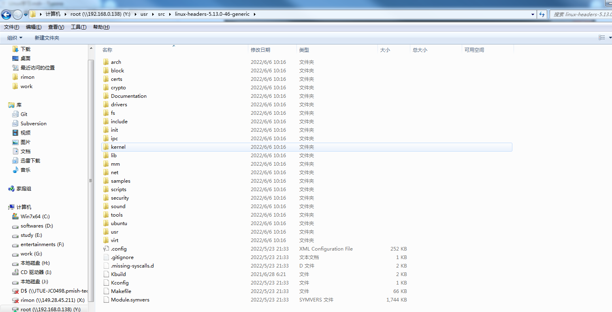
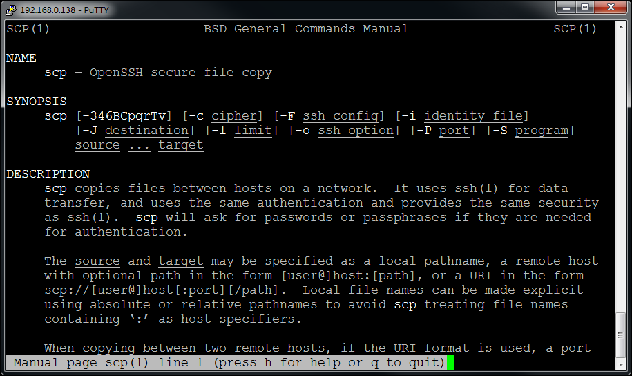

# Linux学习指引

​                                                                                                                                                                                   Edited by Rimon Chen

## 1 Linux发行版本选择

选择合适自己的，个人建议Ubuntu，原因如下：

(1) 有比较全的软件仓库(APT)，同时输入命令时如果未安装会提示安装的软件包(yum就没那么智能)

​    

(2) 相对易用的软件界面（作为入门还是可以的，后面慢慢需要摆脱出来）

​    推荐方法虚拟机+samba+ssh

(3) 基于标准内核之上的相对独立的修改（而不是魔改版本，如雨林木风OS)



(4) 完善的论坛、社区（不要永远只会百度)      https://askubuntu.com/

## 2 Linux环境设置

openssh(证书登录)

samba

vim(配合nerdtree插件)

## 3 Linux Shell

鸟哥 Linux 私房菜：基础版.pdf

man: 不懂就问男人，不要永远只会百度，你出现的问题别人不一定遇到，别人遇到解决后也不一定发到网上，哪怕发到网上的也不一定解释全面，man帮助手册是最全最权威性的资料



## 4 Linux编程

### 4.1 Linux编程环境准备

make

gcc

cgdb

cmake/qt

### 4.1 Linux工程管理

makefile

CMakeLists.txt

project.pro

### 4.2 Linux系统API编程

Linux系统编程.pdf

errno: 函数调用的常见错误码

守护进程编写（促使你去了解文件描述符、标准输入输出、错误输出、fork、进程、进程树、会话、工作目录等概念）

### 4.3 Linux网络编程

Linux网络编程.pdf
socket编程接口
基于TCP的协议设计

### 4.4 Linux程序调试

#### 4.4.1 GDB

编译代码时加上“-g -o0

| 选项   | 备注                                                         |
| ------ | ------------------------------------------------------------ |
| -O0    | 不做任何优化，这是默认的编译选项                             |
| O和-O1 | 优化会消耗少多的编译时间，它主要对代码的分支，常量以及表达式等进行优化。 |
| -O2    | 会尝试更多的寄存器级的优化以及指令级的优化，它会在编译期间占用更多的内存和编译时间。 |
| -O3    | 在O2的基础上进行更多的优化，例如使用伪寄存器网络，普通函数的内联，以及针对循环的更多优化。 |
| -Os    | 主要是对代码大小的优化，我们基本不用做更多的关心。 通常各种优化都会打乱程序的结构，让调试工作变得无从着手。并且会打乱执行顺序，依赖内存操作顺序的程序需要做相关处理才能确保程序的正确性。 |

启动gdb如下：

```bash
gdb ./cgdbtest
```


常用命令：

| 命令                      | 意义                                                         |
| ------------------------- | ------------------------------------------------------------ |
| set args 参数             | 设置程序启动参数                                             |
| info 参数                 | 列出相关信息，支持的有<br />info thread 列出当前所有线程<br />info sources 列出当前进程的源文件<br />info stack 列出调用栈<br />info breakpoints  列出所有断点信息 |
| b 行号<br />b 文件名:行号 | 在指定文件的对应行设置断点                                   |
| disable 数字              | 禁用info b 对应编号的断点                                    |
| enable 数字               | 启动info b 对应编号的断点                                    |


#### 4.4.2 CGDB

CGDB是GDB的前端，以类似于vim的方式可视相关代码和指令，非常方便。启动cgdb如下

```bash
cgdb ./cgdbtest
```

启动后界面如下：


常用快捷键:

| 快捷键   | 意义                    |
| -------- | ----------------------- |
| ESC      | 进入代码窗口            |
| i        | 进入调试窗口            |
| space    | 在代码窗口设置/取消断点 |
| o        | 打开代码所在的文件      |
| /        | 在代码中搜索字符串      |
| ?        | 在代码中搜索字符串      |
| -        | 缩小代码窗口            |
| +        | 扩大代码窗口            |
| gg       | 光标移动到文件头部      |
| GG       | 光标移动到文件尾部      |
| ctrl + b | 代码向上翻一页          |
| ctrl + u | 代码向上翻半页          |
| ctrl + f | 代码向下翻一页          |
| ctrl + d | 代码向下翻半页          |


远程gdb+vscode

ulimit -c unlimited

善于使用proc/sys虚拟文件系统获取信息

查看/var/log下面相关的log

demsg

### 4.5 Linux驱动程序了解

虽然不一定要写驱动，稍微了解一下框架有助于理解Linux的一些概念，便于定位问题

### 4.6 Linux源码阅读


## 5 Linux交叉编译

### 5.1 项目根本概况

完整的一个Linux可运行系统包括三件套: 

(1) Bootloeader

(2) Linux Kernel

(3) rootfs(根文件系统)


uboot+Linux源码，Linux开机引导过程。没有开发板用qemu，简单的选项处理，不需要精通，有个概念即可。

开发板: vexpress-a9

工具链: gcc-linaro-6.3.1-2017.02-x86_64_arm-linux-gnueabihf.tar

Bootloader: 最新版本的uboot

系统: linux-4.9.240

根文件系统: Buildroot

### 5.2 QEMU编译

```bash
# libglib2.0-dev
# libpixman-1-dev
./configure
make 
make install
```

### 5.3 交叉工具链

arm-linux-gnueabihf

### 5.4 uboot编译

编译命令如下，最终生成u-boot.bin文件:

```bash
make vexpress_ca9x4_defconfig
make CROSS_COMPILE=arm-linux-gnueabihf- all
```


### 5.5 根文件系统制作

两种方式: 

(1) busybox + 手工制作文件系统

(2) 下载buildroot并制作

```bash
make menuconfig
make
```


我们主要配置以下项:

Target options -> Target Architecture (ARM (little endian))

Build options -> 

Toolchain -> Toolchain type(External toolchain)

System configuration -> Run a getty (login prompt) after boot -> (ttyAMA0) TTY port

把前面 buildroot 编译的 rootfs.cpio.lz4 拷贝到 linux kernel 根目录下，执行以下命令：

```bash
make ARCH=arm menuconfig
```

如图界面：


修改以下参数：

G e n e r a l   s e t u p - > I n i t r a m f s   s o u r c e   f i l e rootfs.cpio.lz4

Kernel hacking->printk and dmesg options

最后执行make:

```bash
make ARCH=arm CROSS_COMPILE=arm-linux-gnueabihf-  -j8
```

### 5.6 启动QEMU

(1) 制作sd卡镜像

```bash
dd if=/dev/zero of=sd.img bs=4096 count=4096
mkfs.vfat sd.img
sudo mount sd.img /mnt/ -o loop,rw
sudo cp arch/arm/boot/zImage /mnt/
sudo cp arch/arm/boot/dts/vexpress-v2p-ca9.dtb /mnt/
sudo umount /mnt
```

(2) 把编译好的kernel zImage 和 dtb 文件拷贝到 sd.img 中


制作完成后启动

```bash
sudo qemu-system-arm -M vexpress-a9 -m 512M -kernel ./u-boot -nographic -sd sd.img
```

启动进入如下输出：

```bash
[    0.000000] Booting Linux on physical CPU 0x0
[    0.000000] Linux version 4.9.240 (rimon@rimon-ubuntu) (gcc version 6.3.1 20170109 (Linaro GCC 6.3-2017.02) ) #1 SMP Thu Oct 22 18:44:10 CST 2020
[    0.000000] CPU: ARMv7 Processor [410fc090] revision 0 (ARMv7), cr=10c5387d
[    0.000000] CPU: PIPT / VIPT nonaliasing data cache, VIPT nonaliasing instruction cache
[    0.000000] OF: fdt:Machine model: V2P-CA9
[    0.000000] Memory policy: Data cache writeback
[    0.000000] CPU: All CPU(s) started in SVC mode.
[    0.000000] percpu: Embedded 12 pages/cpu s19148 r8192 d21812 u49152
[    0.000000] Built 1 zonelists in Zone order, mobility grouping on.  Total pages: 130048
[    0.000000] Kernel command line: console=ttyAMA0
[    0.000000] log_buf_len individual max cpu contribution: 4096 bytes
[    0.000000] log_buf_len total cpu_extra contributions: 12288 bytes
[    0.000000] log_buf_len min size: 16384 bytes
[    0.000000] log_buf_len: 32768 bytes
[    0.000000] early log buf free: 15028(91%)
[    0.000000] PID hash table entries: 2048 (order: 1, 8192 bytes)
[    0.000000] Dentry cache hash table entries: 65536 (order: 6, 262144 bytes)
[    0.000000] Inode-cache hash table entries: 32768 (order: 5, 131072 bytes)
[    0.000000] Memory: 508864K/524288K available (5120K kernel code, 176K rwdata, 1200K rodata, 3072K init, 151K bss, 15424K reserved, 0K cma-reserved)
[    0.000000] Virtual kernel memory layout:
[    0.000000]     vector  : 0xffff0000 - 0xffff1000   (   4 kB)
[    0.000000]     fixmap  : 0xffc00000 - 0xfff00000   (3072 kB)
[    0.000000]     vmalloc : 0xa0800000 - 0xff800000   (1520 MB)
[    0.000000]     lowmem  : 0x80000000 - 0xa0000000   ( 512 MB)
[    0.000000]     modules : 0x7f000000 - 0x80000000   (  16 MB)
[    0.000000]       .text : 0x80008000 - 0x80600000   (6112 kB)
[    0.000000]       .init : 0x80800000 - 0x80b00000   (3072 kB)
[    0.000000]       .data : 0x80b00000 - 0x80b2c300   ( 177 kB)
[    0.000000]        .bss : 0x80b2e000 - 0x80b53c30   ( 152 kB)
[    0.000000] SLUB: HWalign=64, Order=0-3, MinObjects=0, CPUs=4, Nodes=1
[    0.000000] Hierarchical RCU implementation.
[    0.000000]  Build-time adjustment of leaf fanout to 32.
[    0.000000]  RCU restricting CPUs from NR_CPUS=8 to nr_cpu_ids=4.
[    0.000000] RCU: Adjusting geometry for rcu_fanout_leaf=32, nr_cpu_ids=4
[    0.000000] NR_IRQS:16 nr_irqs:16 16
[    0.000000] GIC CPU mask not found - kernel will fail to boot.
[    0.000000] GIC CPU mask not found - kernel will fail to boot.
[    0.000000] L2C: platform modifies aux control register: 0x02020000 -> 0x02420000
[    0.000000] L2C: DT/platform modifies aux control register: 0x02020000 -> 0x02420000
[    0.000000] L2C-310 enabling early BRESP for Cortex-A9
[    0.000000] L2C-310 full line of zeros enabled for Cortex-A9
[    0.000000] L2C-310 dynamic clock gating disabled, standby mode disabled
[    0.000000] L2C-310 cache controller enabled, 8 ways, 128 kB
[    0.000000] L2C-310: CACHE_ID 0x410000c8, AUX_CTRL 0x46420001
[    0.000000] smp_twd: clock not found -2
[    0.000254] sched_clock: 32 bits at 24MHz, resolution 41ns, wraps every 89478484971ns
[    0.002855] clocksource: arm,sp804: mask: 0xffffffff max_cycles: 0xffffffff, max_idle_ns: 1911260446275 ns
[    0.003465] Failed to initialize '/smb@04000000/motherboard/iofpga@7,00000000/timer@12000': -22
[    0.007589] Console: colour dummy device 80x30
[    0.008122] Calibrating local timer... 93.88MHz.
[    0.063664] Calibrating delay loop... 675.02 BogoMIPS (lpj=3375104)
[    0.167211] pid_max: default: 32768 minimum: 301
[    0.168177] Mount-cache hash table entries: 1024 (order: 0, 4096 bytes)
[    0.168211] Mountpoint-cache hash table entries: 1024 (order: 0, 4096 bytes)
[    0.179869] CPU: Testing write buffer coherency: ok
[    0.180425] CPU0: Spectre v2: using BPIALL workaround
[    0.191164] CPU0: thread -1, cpu 0, socket 0, mpidr 80000000
[    0.191514] Setting up static identity map for 0x60100000 - 0x60100058
[    0.206993] Brought up 1 CPUs
[    0.207117] SMP: Total of 1 processors activated (675.02 BogoMIPS).
[    0.207178] CPU: All CPU(s) started in SVC mode.
[    0.244810] devtmpfs: initialized
[    0.256198] VFP support v0.3: implementor 41 architecture 3 part 30 variant 9 rev 0
[    0.273637] clocksource: jiffies: mask: 0xffffffff max_cycles: 0xffffffff, max_idle_ns: 19112604462750000 ns
[    0.274608] futex hash table entries: 1024 (order: 4, 65536 bytes)
[    0.316791] NET: Registered protocol family 16
[    0.324372] DMA: preallocated 256 KiB pool for atomic coherent allocations
[    0.443732] cpuidle: using governor ladder
[    0.443891] hw-breakpoint: debug architecture 0x4 unsupported.
[    0.444429] Serial: AMBA PL011 UART driver
[    0.450851] OF: amba_device_add() failed (-19) for /memory-controller@100e0000
[    0.451403] OF: amba_device_add() failed (-19) for /memory-controller@100e1000
[    0.451687] OF: amba_device_add() failed (-19) for /watchdog@100e5000
[    0.452825] irq: type mismatch, failed to map hwirq-75 for /interrupt-controller@1e001000!
[    0.461642] 10009000.uart: ttyAMA0 at MMIO 0x10009000 (irq = 38, base_baud = 0) is a PL011 rev1
[    0.518742] console [ttyAMA0] enabled
[    0.522172] 1000a000.uart: ttyAMA1 at MMIO 0x1000a000 (irq = 39, base_baud = 0) is a PL011 rev1
[    0.528904] 1000b000.uart: ttyAMA2 at MMIO 0x1000b000 (irq = 40, base_baud = 0) is a PL011 rev1
[    0.536498] 1000c000.uart: ttyAMA3 at MMIO 0x1000c000 (irq = 41, base_baud = 0) is a PL011 rev1
[    0.542301] OF: amba_device_add() failed (-19) for /smb@04000000/motherboard/iofpga@7,00000000/wdt@0f000
[    0.601598] SCSI subsystem initialized
[    0.611134] usbcore: registered new interface driver usbfs
[    0.615376] usbcore: registered new interface driver hub
[    0.616570] usbcore: registered new device driver usb
[    0.624220] Advanced Linux Sound Architecture Driver Initialized.
[    0.642411] clocksource: Switched to clocksource arm,sp804
[    0.690188] NET: Registered protocol family 2
[    0.700776] TCP established hash table entries: 4096 (order: 2, 16384 bytes)
[    0.705745] TCP bind hash table entries: 4096 (order: 3, 32768 bytes)
[    0.706738] TCP: Hash tables configured (established 4096 bind 4096)
[    0.708502] UDP hash table entries: 256 (order: 1, 8192 bytes)
[    0.710210] UDP-Lite hash table entries: 256 (order: 1, 8192 bytes)
[    0.712551] NET: Registered protocol family 1
[    0.718248] RPC: Registered named UNIX socket transport module.
[    0.722785] RPC: Registered udp transport module.
[    0.723710] RPC: Registered tcp transport module.
[    0.724445] RPC: Registered tcp NFSv4.1 backchannel transport module.
[    0.932228] hw perfevents: enabled with armv7_cortex_a9 PMU driver, 5 counters available
[    0.944398] workingset: timestamp_bits=30 max_order=17 bucket_order=0
[    0.972817] squashfs: version 4.0 (2009/01/31) Phillip Lougher
[    0.980892] jffs2: version 2.2. (NAND) © 2001-2006 Red Hat, Inc.
[    0.988443] 9p: Installing v9fs 9p2000 file system support
[    0.996797] io scheduler noop registered (default)
[    1.006810] clcd-pl11x 10020000.clcd: PL111 designer 41 rev2 at 0x10020000
[    1.019644] clcd-pl11x 10020000.clcd: /clcd@10020000 hardware, 1024x768@59 display
[    1.104862] Console: switching to colour frame buffer device 128x48
[    1.115552] clcd-pl11x 1001f000.clcd: PL111 designer 41 rev2 at 0x1001f000
[    1.117536] clcd-pl11x 1001f000.clcd: /smb@04000000/motherboard/iofpga@7,00000000/clcd@1f000 hardware, 640x480@59 display
[    1.403685] 40000000.flash: Found 2 x16 devices at 0x0 in 32-bit bank. Manufacturer ID 0x000000 Chip ID 0x000000
[    1.408844] Intel/Sharp Extended Query Table at 0x0031
[    1.410556] Using buffer write method
[    1.414869] 40000000.flash: Found 2 x16 devices at 0x0 in 32-bit bank. Manufacturer ID 0x000000 Chip ID 0x000000
[    1.418859] Intel/Sharp Extended Query Table at 0x0031
[    1.419957] Using buffer write method
[    1.421077] Concatenating MTD devices:
[    1.421634] (0): "40000000.flash"
[    1.421924] (1): "40000000.flash"
[    1.422269] into device "40000000.flash"
[    1.577540] libphy: Fixed MDIO Bus: probed
[    1.682192] libphy: smsc911x-mdio: probed
[    1.688800] smsc911x 4e000000.ethernet eth0: MAC Address: 52:54:00:12:34:56
[    1.801653] isp1760 4f000000.usb: bus width: 32, oc: digital
[    1.806312] isp1760 4f000000.usb: NXP ISP1760 USB Host Controller
[    1.807570] isp1760 4f000000.usb: new USB bus registered, assigned bus number 1
[    1.809389] isp1760 4f000000.usb: Scratch test failed.
[    1.810653] isp1760 4f000000.usb: can't setup: -19
[    1.811548] isp1760 4f000000.usb: USB bus 1 deregistered
[    1.814636] usbcore: registered new interface driver usb-storage
[    1.822373] mousedev: PS/2 mouse device common for all mice
[    1.839290] rtc-pl031 10017000.rtc: rtc core: registered pl031 as rtc0
[    1.851380] mmci-pl18x 10005000.mmci: Got CD GPIO
[    1.855530] mmci-pl18x 10005000.mmci: Got WP GPIO
[    1.858575] mmci-pl18x 10005000.mmci: mmc0: PL181 manf 41 rev0 at 0x10005000 irq 34,35 (pio)
[    1.923847] ledtrig-cpu: registered to indicate activity on CPUs
[    1.930878] usbcore: registered new interface driver usbhid
[    1.934767] usbhid: USB HID core driver
[    1.939796] input: AT Raw Set 2 keyboard as /devices/platform/smb@04000000/smb@04000000:motherboard/smb@04000000:motherboard:iofpga@7,00000000/10006000.kmi/serio0/input/input0
[    1.987358] aaci-pl041 10004000.aaci: ARM AC'97 Interface PL041 rev0 at 0x10004000, irq 33
[    1.991900] aaci-pl041 10004000.aaci: FIFO 512 entries
[    1.993544] oprofile: using arm/armv7-ca9
[    1.995700] NET: Registered protocol family 17
[    1.997629] 9pnet: Installing 9P2000 support
[    1.999154] Registering SWP/SWPB emulation handler
[    2.010443] rtc-pl031 10017000.rtc: setting system clock to 2022-08-31 13:57:11 UTC (1661954231)
[    2.017391] ALSA device list:
[    2.020562]   #0: ARM AC'97 Interface PL041 rev0 at 0x10004000, irq 33
[    2.052318] Freeing unused kernel memory: 3072K
[    2.547453] input: ImExPS/2 Generic Explorer Mouse as /devices/platform/smb@04000000/smb@04000000:motherboard/smb@04000000:motherboard:iofpga@7,00000000/10007000.kmi/serio1/input/input2
Starting syslogd: OK
Starting klogd: OK
Running sysctl: OK
Saving random seed: [    3.735154] random: dd: uninitialized urandom read (512 bytes read)
OK
Starting network: OK

Welcome to Buildroot
buildroot login: root
# ls
# ls -all /
total 4
drwxr-xr-x   17 root     root           400 Oct 22  2020 .
drwxr-xr-x   17 root     root           400 Oct 22  2020 ..
drwxr-xr-x    2 root     root          1520 Oct 22  2020 bin
drwxr-xr-x    6 root     root          3000 Aug 31 13:57 dev
drwxr-xr-x    5 root     root           420 Oct 22  2020 etc
-rwxr-xr-x    1 root     root           462 Oct 22  2020 init
drwxr-xr-x    2 root     root           620 Oct 22  2020 lib
lrwxrwxrwx    1 root     root             3 Oct 22  2020 lib32 -> lib
lrwxrwxrwx    1 root     root            11 Oct 22  2020 linuxrc -> bin/busybox
drwxr-xr-x    2 root     root            40 Oct 22  2020 media
drwxr-xr-x    2 root     root            40 Oct 22  2020 mnt
drwxr-xr-x    2 root     root            40 Oct 22  2020 opt
dr-xr-xr-x   61 root     root             0 Jan  1  1970 proc
drwx------    2 root     root            60 Aug 31 13:57 root
drwxr-xr-x    3 root     root           140 Aug 31 13:57 run
drwxr-xr-x    2 root     root          1120 Oct 22  2020 sbin
dr-xr-xr-x   12 root     root             0 Aug 31 13:57 sys
drwxrwxrwt    2 root     root            60 Aug 31 13:57 tmp
drwxr-xr-x    6 root     root           140 Oct 22  2020 usr
drwxr-xr-x    4 root     root           200 Oct 22  2020 var
#


```


