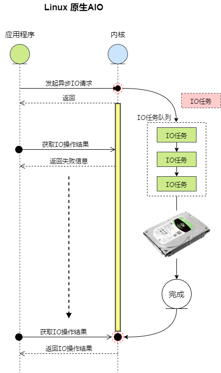

# Linux C API

# 1 文件IO

1.0 基本的IO函数

open/read/write/mmap

## 1.1 阻塞IO(BIO)

## 1.2 非阻塞IO

## 1.3 异步IO(AIO)使用

### 1.3.1 什么是异步 IO？

异步 IO：当应用程序发起一个 IO 操作后，调用者不能立刻得到结果，而是在内核完成 IO 操作后，通过信号或回调来通知调用者。


### 1.3.2 LInux AIO原生API

```c
#include <linux/aio_abi.h>
int io_setup(unsigned nr_events, aio_context_t *ctxp);
int io_destroy(aio_context_t ctx);
int io_submit(aio_context_t ctx, long nr, struct iocb **iocbpp);
int io_cancel(aio_context_t ctx, struct iocb *, struct io_event *result);
int io_getevents(aio_context_t ctx, long min_nr, long nr,
    struct io_event *events, struct timespec *timeout);

```

每个IO请求(对应结构体struct iocb)都被提交到一个AIO的上下文(对应aio_context_t ，其实是一个数字)中，上下文通过 io_setup创建， io_destroy销毁。
io_submit函数一次可以提交多个IO请求到指定的上下文中。相应地通过io_cancel取消多个IO请求
在提交IO请求之后，可以去处理其它的事情。过段时间，通过io_getevents来获取一下IO请求状态。需要指定前面的上下文， 然后就是一个iocb的缓存区，等待完成IO的最少、最大数目。如果没有达到最少的IO数，则会阻塞知道满足条件。当然，也可以设置超时时间。



### 1.3.3 AIO使用

(1) 使用内核的系统调用

使用系统函数syscall调用相关的接口SYS_io_setup，详细代码如下所示

```c
#include <unistd.h>
#include <fcntl.h>
#include <sys/syscall.h>
#include <linux/aio_abi.h>
#include <errno.h>

int io_setup(unsigned nr, aio_context_t* ctxp)
{
	return syscall(SYS_io_setup, nr, ctxp);
}

int io_destroy(aio_context_t ctx)
{
	return syscall(SYS_io_destroy, ctx);
}

int io_submit(aio_context_t ctx, long nr, struct iocb** iocbpp)
{
	return syscall(SYS_io_submit, ctx, nr, iocbpp);
}

int io_getevents(aio_context_t ctx, long min_nr, long max_nr,
	struct io_event* events, struct timespec* timeout)
{
	return syscall(SYS_io_getevents, ctx, min_nr, max_nr, timeout);
}

```

(2) 使用用户空间上的libaio库

在ubuntu上可以简单通过安装libaio-dev

(3) 在用户态模拟假的AIO(librt)

## 1.4 IO多路复用

1.4.1 select

1.4.2 poll

1.4.3 epoll

## 1.5 信号驱动IO模型

(1) 通过sigaction系统调用建立SIGIO的信号处理程序