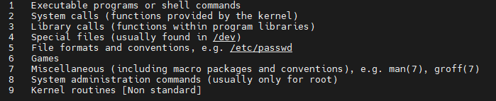

# Shell

## 1 Shell的种类

- Bourne Shell（sh）
- Bourne Again shell（bash）
- C Shell（csh）
- TENEX C Shell（tcsh）
- Korn shell（ksh）
- Z Shell（zsh）
- Friendly Interactive Shell（fish）

其中bash是目前最常用的shell。通过下如命令查询你当前系统中的Shell类型：

```bash
echo $SHELL
```

还可以通过以下命令查询你当前系统安装的所有Shell种类:

```bash
cat /etc/shells
```

## 2 常用快捷方式

- 通过上下方向键 ↑ ↓ 来调取过往执行过的 `Linux` 命令；
- 命令或参数仅需输入前几位就可以用 `Tab` 键补全；
- `Ctrl + R` ：用于查找使用过的命令（`history` 命令用于列出之前使用过的所有命令，然后输入 `!` 命令加上编号( `!2` )就可以直接执行该历史命令）；
- `Ctrl + L`：清除屏幕并将当前行移到页面顶部；
- `Ctrl + C`：中止当前正在执行的命令；
- `Ctrl + U`：从光标位置剪切到行首；
- `Ctrl + K`：从光标位置剪切到行尾；
- `Ctrl + W`：剪切光标左侧的一个单词；
- `Ctrl + Y`：粘贴 `Ctrl + U | K | Y` 剪切的命令；
- `Ctrl + A`：光标跳到命令行的开头；
- `Ctrl + E`：光标跳到命令行的结尾；
- `Ctrl + D`：关闭 `Shell` 会话；

## 3 帮助文档(man)

### 3.1 man手册种类



### 3.2 

## 4 Shell命令语法

### 4.1 一般命令

man
echo 
exit
clear
alias

### 4.2 文件操作

ls
find
cd
cp
mv
mkdir
rm
rmdir
touch
dd
chmod
chown
chgrp
mount
unmount
ln
tar
zip
unzip
xz
sync

### 4.3 文本操作 

cat
grep
head
tail
more
less
wc
diff

### 4.4 进程相关

#### 4.4.1 top

#### 4.4.2 ps

- 命令格式

ps [选项]

- 常用命令

```bash
ps -ef
ps -aux # 嵌入式系统中常不支持
```


#### 4.4.3 pstree

#### 4.4.4 kill

#### 4.4.5 killall

#### 4.4.6 pkill

#### 4.4.7 lsof

- 命令格式

ls [选项] [文件]

常用参数是:

```
-a 列出打开文件存在的进程

-c<进程名> 列出指定进程所打开的文件

-g  列出GID号进程详情

-d<文件号> 列出占用该文件号的进程

+d<目录>  列出目录下被打开的文件

+D<目录>  递归列出目录下被打开的文件

-n<目录>  列出使用NFS的文件

-i<条件>  列出符合条件的进程。（4、6、协议、:端口、 @ip ）

-p<进程号> 列出指定进程号所打开的文件

-u  列出UID号进程详情

-h 显示帮助信息

-v 显示版本信息
```


文件可以是:  普通文件、目录、网络文件系统的文件、字符或者设备文件、(函数)共享库、管道、符号链接、网络文件、其它文件

- 常用列出指定pid进程打开的文件

```bash
lsof -p pid # 进程ID
lsof -c pname #进程名
```

#### 4.4.8 nohup

#### 4.4.9 jobs

#### 4.4.10 bg

#### 4.4.11 fg

### 4.5 网络相关

host

ifconfig
ip
ping
netstat
telnet
route
ssh
scp
ftp
wget
curl

### 4.6 软件安装

yum

apt

snap
dpkg

### 4.7 内核相关

dmesg
uname
insmod
lsmod
rmmod
modinfo
modprobe
depmod


