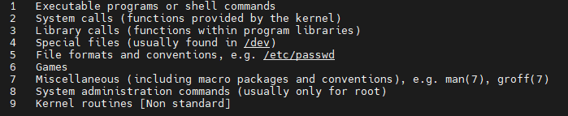

# Shell

# 1 Shell的种类

- Bourne Shell（sh）
- Bourne Again shell（bash）
- C Shell（csh）
- TENEX C Shell（tcsh）
- Korn shell（ksh）
- Z Shell（zsh）
- Friendly Interactive Shell（fish）

其中bash是目前最常用的shell。通过下如命令查询你当前系统中的Shell类型：

```bash
echo $SHELL
```

还可以通过以下命令查询你当前系统安装的所有Shell种类:

```bash
cat /etc/shells
```

# 2 常用快捷方式

- 通过上下方向键 ↑ ↓ 来调取过往执行过的 `Linux` 命令；
- 命令或参数仅需输入前几位就可以用 `Tab` 键补全；
- `Ctrl + R` ：用于查找使用过的命令（`history` 命令用于列出之前使用过的所有命令，然后输入 `!` 命令加上编号( `!2` )就可以直接执行该历史命令）；
- `Ctrl + L`：清除屏幕并将当前行移到页面顶部；
- `Ctrl + C`：中止当前正在执行的命令；
- `Ctrl + U`：从光标位置剪切到行首；
- `Ctrl + K`：从光标位置剪切到行尾；
- `Ctrl + W`：剪切光标左侧的一个单词；
- `Ctrl + Y`：粘贴 `Ctrl + U | K | Y` 剪切的命令；
- `Ctrl + A`：光标跳到命令行的开头；
- `Ctrl + E`：光标跳到命令行的结尾；
- `Ctrl + D`：关闭 `Shell` 会话；

# 3 帮助文档(man)

## 3.1 man手册种类



## 3.2 

# 4 Shell命令语法

## 4.1 一般命令

man
echo 
exit
clear
alias

## 4.2 文件操作

ls
find
cd
cp
mv
mkdir
rm
rmdir
touch
dd
chmod
chown
chgrp
mount
unmount
ln
tar
zip
unzip
xz
sync

## 4.3 文本操作 

### 4.3.1 文本三剑客awk sed grep

awk

sed

grep


cat
head
tail
more
less
wc
diff

## 4.4 进程相关

### 4.4.1 top

### 4.4.2 ps

- 命令格式

ps [选项]

- 常用命令

```bash
ps -ef
ps -aux # 嵌入式系统中常不支持
```


### 4.4.3 pstree

### 4.4.4 kill

### 4.4.5 killall

### 4.4.6 pkill

### 4.4.7 lsof

- 命令格式

ls [选项] [文件]

常用参数是:

```
-a 列出打开文件存在的进程

-c<进程名> 列出指定进程所打开的文件

-g  列出GID号进程详情

-d<文件号> 列出占用该文件号的进程

+d<目录>  列出目录下被打开的文件

+D<目录>  递归列出目录下被打开的文件

-n<目录>  列出使用NFS的文件

-i<条件>  列出符合条件的进程。（4、6、协议、:端口、 @ip ）

-p<进程号> 列出指定进程号所打开的文件

-u  列出UID号进程详情

-h 显示帮助信息

-v 显示版本信息
```


文件可以是:  普通文件、目录、网络文件系统的文件、字符或者设备文件、(函数)共享库、管道、符号链接、网络文件、其它文件

- 常用列出指定pid进程打开的文件

```bash
lsof -p pid # 进程ID
lsof -c pname #进程名
```

### 4.4.8 nohup

### 4.4.9 jobs

### 4.4.10 bg

### 4.4.11 fg

### 4.4.12 time

用time启动进程

## 4.5 网络相关

host

ifconfig
ip
ping
netstat
telnet
route
ssh
scp
ftp
wget
curl

## 4.6 软件安装

yum

apt

snap
dpkg

## 4.7 内核相关

dmesg
uname
insmod
lsmod
rmmod
modinfo
modprobe
depmod

# 5 Shell脚本

##  5.1 条件表达式

### 5.1.1 真与假

在 POSIX 标准下，程序的 退出状态为零表示成功，非零表示失败。这个与C/C++的main函数返回值是一致的， 而 Bash 的表达式就是命令调用，因此 0 为真（命令调用成功）1 为假（命令调用失败）。

在shell脚本中也有true/false命令，在有些shell中true/false是build-in命令，有些则是/usr/bin/true、/usr/bin/false，具体可以通过以下脚本查询

```bash
type true
type false
```

### 5.1.2 subshell

`()`在shell中是特殊字符，可以通过`( expression )`来实现subshell， subshell 是一种特殊的子进程，可以用`$()`把结果赋值给另外的变量。subshell可以访问父进程的任何变量，但 subshell 仍然是一种子进程，这意味着 subshell 中环境变量的定义和赋值对父 shell 是不可见的。

```bash
unset a; a=1
(echo "a is $a in the subshell")            # a is 1 in the subshell
sh -c 'echo "a is $a in the child shell"'   # a is  in the child shell
```

### 5.1.3 test命令

test 命令可以用来测试文件是否存在、文件类型，也可以进行字符串判等、数字比较等操作。 在测试为真时 `test` 命令的退出码为 0，测试为假时退出码为 1，发生错误时大于 1。

```bash
test expression
[ expression ]
```

注意第二种用法中 `[` 是一个命令，`expression` 和 `]` 是它的两个参数。 因此如果 `[` 后没有空格会发生 command not found 错误。

例如：

```bash
if test -e harttle.png; then
    echo file exists
fi
```

等价于：

```bash
if [ -e harttle.png ]; then
    echo file exists
fi
```

常用参数:

(1) 文件判断

```bash
-e file: file 存在
-d file: file 是一个目录
-f file: file 是一个普通文件（regular file）
-s file: file 非空（大小不为零）
-w file: file 是否有可写标志
-x file: file 是否有可执行标志
```

(2) 字符串判断

```bash
-n string: 字符串长度非零
-z string: 字符串长度为零
string1 = string2: 字符串相等
string1 != string2: 字符串不相等
string: 字符串不是null时为真，否则为假
```

(3) 数字判断

```bash
num1 -eq num2: 等于
num1 -ne num2: 不等于
num1 -le num2: 小于等于
num1 -lt num2: 小于
num1 -ge num2: 大于等于
num1 -gt num2: 大于
```

如果参数替换的结果是空，那么就会因为缺少参数而崩掉，所以需要引号包裹所有变量来保证参数总是存在的，字符串判断也需要一样的处理。例如

```bash
a=
test 1 -eq "$a"
echo $?
```

(4) 逻辑运算

当然，与（`-a`）或（`-o`）非（`!`）都是支持的。但括号要转义，因为括号是 Shell 特殊字符，用来开启子 Shell 的。 一个复杂的例子如下：

```bash
if [ ! \( -f harttle.png \) ]; then
    echo file not found
fi
```

需要强调的仍然是**注意空格**！即使 `\(` 也是需要单独一个参数传递给 `[` 命令。 下面的代码会产生错误：`[: (-f: unary operator expected`， 因为 `!` 是单目运算符（Unary Operator），但后面跟着的是两个参数：`\(-f` 和 `harttle.png\)`。

```bash
if [ ! \(-f harttle.png\) ]; then
    echo file not found
fi
```

(5) [[ 条件表达式

与`true`、`false`、`[`一样,`[[`也是一个命令，可以把 `[[ expression ]]` 看做是 `[` 的现代版本，支持正则表达式，它与 `test` 命令有几乎一样的参数。 但它是一个新的语法结构，不再是一个普通的 test命令，因此不受制与 Shell 的 **参数展开**，比如 不需要用引号包裹所有变量，也支持类似 `&&`，`||` 这样的逻辑操作而不需要用类似 `-a`，`-o` 这样的参数。

```bash
if [[ $string1 == 'harttle' ]]; then
    echo The author for this article is harttle
fi
```

(6) 算术展开（Arithmetic Expansion）

算术展开的语法是`$((expression))`，会依次进行参数展开、命令替换，和 引号移除。expression可以是C风格的语法
